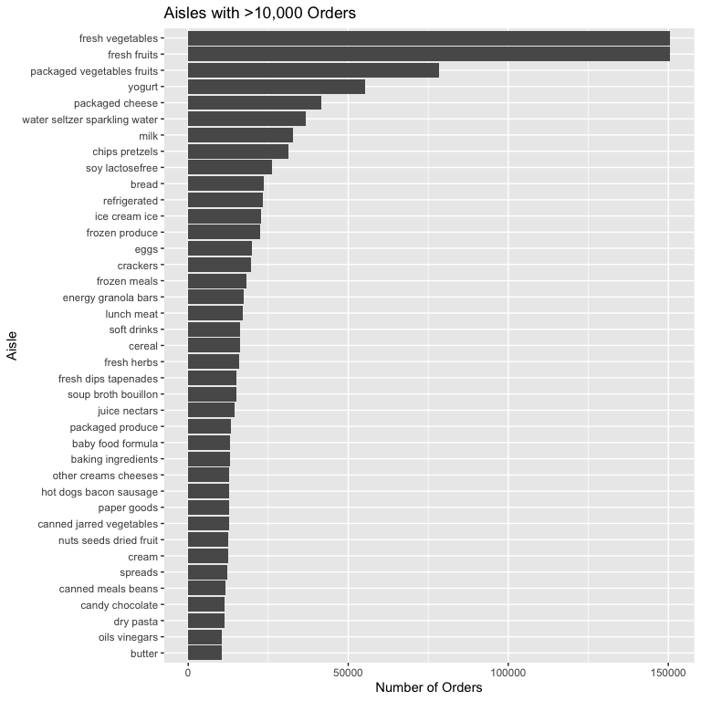

p8105_hw3_xm2356
================
Xinyin Miao (xm2356)
2025-10-06

``` r
library(tidyverse)
```

# Problem 1

``` r
library(p8105.datasets)
data("instacart")
```

The instacart dataset is a large dataframe containing 1384617
observations and 15 variables. Each observation represents a single item
within a customer’s order. Key variables include:

order_id: A unique identifier for each order. product_id: A unique
identifier for each product. product_name: The name of the product.
aisle_id and aisle: The aisle number and name where the product is
located. department: The department name. order_dow: The day of the week
the order was placed. order_hour_of_day: The hour of the day the order
was placed.

``` r
instacart |> 
  summarize(
    total_obs = n(),
    unique_users = n_distinct(user_id),
    unique_orders = n_distinct(order_id),
    unique_aisles = n_distinct(aisle)
  )
```

    ## # A tibble: 1 × 4
    ##   total_obs unique_users unique_orders unique_aisles
    ##       <int>        <int>         <int>         <int>
    ## 1   1384617       131209        131209           134

Take the contents of order ID 1 as an example. This customer ordered 8
items, including ‘Bulgarian Yogurt’, which is from the ‘yogurt’ aisle
and ‘dairy eggs’ department. Within these 8 items, ‘Bulgarian
Yogurt’,‘Organic 4% Milk Fat Whole Milk Cottage Cheese’,‘Lightly Smoked
Sardines in Olive Oil’, ‘Organic Whole String Cheese’ have been ordered
by this user in the past. And the order was placed on Friday at 10
a.m.There are 9 days since the last order.

## How many aisles are there, and which aisles are the most items ordered from?

``` r
unique_aisles = instacart |> 
  summarize(unique_aisles = n_distinct(aisle))

aisle_counts = instacart |> 
  count(aisle, sort = TRUE)

unique_aisles
```

    ## # A tibble: 1 × 1
    ##   unique_aisles
    ##           <int>
    ## 1           134

``` r
head(aisle_counts)
```

    ## # A tibble: 6 × 2
    ##   aisle                              n
    ##   <chr>                          <int>
    ## 1 fresh vegetables              150609
    ## 2 fresh fruits                  150473
    ## 3 packaged vegetables fruits     78493
    ## 4 yogurt                         55240
    ## 5 packaged cheese                41699
    ## 6 water seltzer sparkling water  36617

There are 134 unique aisles in the dataset. The top 5 most ordered-from
aisles are “fresh vegetables”, “fresh fruits”, “packaged vegetables
fruits”, “yogurt”, and “packaged cheese”.

## The number of items ordered in each aisle.

``` r
aisle_counts |> 
  filter(n > 10000) |> 
  mutate(aisle = fct_reorder(aisle, n)) |> 
  ggplot(aes(x = aisle, y = n)) +
  geom_col() +
  coord_flip() +
  labs(title = "Aisles with >10,000 Orders",
       x = "Aisle", y = "Number of Orders")
```

<!-- -->

## The table shows the three most popular items in some of the aisles.

``` r
instacart |> 
  filter(aisle %in% c("baking ingredients", "dog food care", "packaged vegetables fruits")) |> 
  count(aisle, product_name, sort = TRUE) |> 
  group_by(aisle) |> 
  slice_max(n, n = 3) |> 
  knitr::kable()
```

| aisle | product_name | n |
|:---|:---|---:|
| baking ingredients | Light Brown Sugar | 499 |
| baking ingredients | Pure Baking Soda | 387 |
| baking ingredients | Cane Sugar | 336 |
| dog food care | Snack Sticks Chicken & Rice Recipe Dog Treats | 30 |
| dog food care | Organix Chicken & Brown Rice Recipe | 28 |
| dog food care | Small Dog Biscuits | 26 |
| packaged vegetables fruits | Organic Baby Spinach | 9784 |
| packaged vegetables fruits | Organic Raspberries | 5546 |
| packaged vegetables fruits | Organic Blueberries | 4966 |

## The mean hour of the day at which Pink Lady Apples and Coffee Ice Cream are ordered on each day of the week.

``` r
instacart |> 
  filter(product_name %in% c("Pink Lady Apples", "Coffee Ice Cream")) |> 
  group_by(product_name, order_dow) |> 
  summarize(mean_hour = mean(order_hour_of_day)) |> 
  pivot_wider(names_from = order_dow, values_from = mean_hour) |> 
  knitr::kable(digits = 2)
```

| product_name     |     0 |     1 |     2 |     3 |     4 |     5 |     6 |
|:-----------------|------:|------:|------:|------:|------:|------:|------:|
| Coffee Ice Cream | 13.77 | 14.32 | 15.38 | 15.32 | 15.22 | 12.26 | 13.83 |
| Pink Lady Apples | 13.44 | 11.36 | 11.70 | 14.25 | 11.55 | 12.78 | 11.94 |

The table indicates that, on average, Coffee Ice Cream is ordered later
in the day than Pink Lady Apples across all days of the week. Both
products tend to be ordered in the early to mid-afternoon (13:00-15:00).

# Problem 2

tidy the data

``` r
zori_file <- "data/zillow_data/Zip_zori_uc_sfrcondomfr_sm_month_NYC.csv"
zip_file  <- "data/zillow_data/Zip Codes.csv"

zori_df <- read_csv(zori_file) |> 
  pivot_longer(
    cols = matches("^20"),   
    names_to = "month",
    values_to = "rent" # Renamed to 'rent' for clarity
  ) |> 
  mutate(
    month = ymd(month),      
    year = year(month)
  )

zip_df <- read_csv(zip_file) |> 
  janitor::clean_names() |> 
  distinct(zip_code, .keep_all = TRUE)

# Join the data
zillow_df <- zori_df |> 
  left_join(zip_df, by = c("RegionName" = "zip_code")) |> 
  arrange(RegionName, month) |>

  filter(!is.na(county)) |>
  rename(borough = county, zip_code = RegionName) 
```

## Number of ZIP codes observed

``` r
total_months <- n_distinct(zillow_df$month)

zip_summary <- zillow_df |>
  count(zip_code) |>
  summarise(
    total_unique_months = total_months,
    zips_observed_all_months = sum(n == total_months),
    zips_observed_rarely = sum(n < 10)
  )

print(zip_summary)
```

    ## # A tibble: 1 × 3
    ##   total_unique_months zips_observed_all_months zips_observed_rarely
    ##                 <int>                    <int>                <int>
    ## 1                 116                      149                    0
